<div align="center">

# ⚓ Mariner

**A censorship-resilient travel router you build from a Raspberry Pi.**

Plug it in at the hotel, join its Wi-Fi from your phone, and every device you carry
gets a private, VPN-protected connection with a kill switch, captive-portal handling
and a control panel that works offline.

[Quick start](#quick-start) · [Supported VPNs](#supported-vpns) · [How it works](#how-it-works) · [Security model](#security-model) · [Architecture notes](docs/ARCHITECTURE.md)

</div>

<p align="center">
  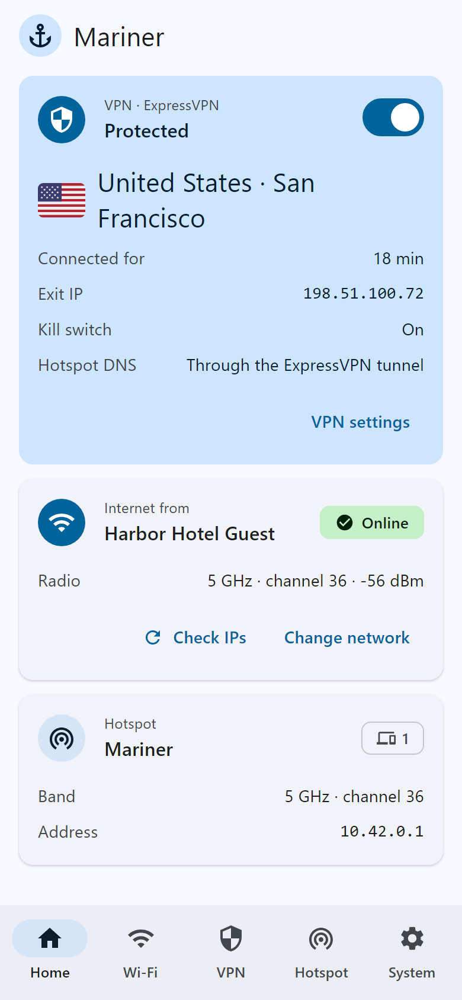
  &nbsp;
  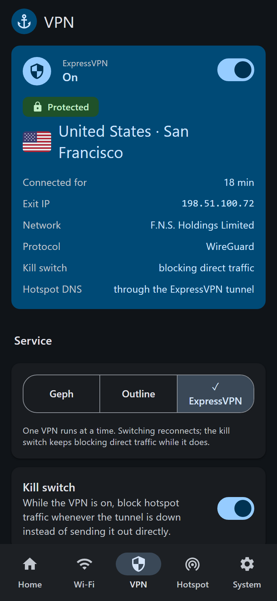
  &nbsp;
  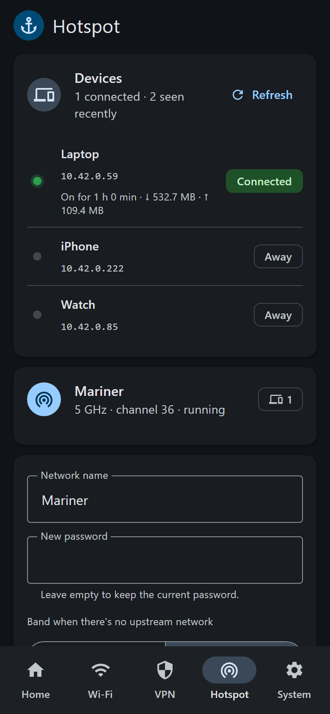
</p>

---

## Why Mariner

Hotel, airport and café networks are where travel connectivity breaks down. Many sit
behind captive portals, some censor or throttle traffic, and most of your devices
(TVs, e-readers, game consoles, a partner's laptop) can't run a VPN at all.

Mariner sits between those networks and your devices:

- **One VPN for everything.** Anything that joins Mariner's Wi-Fi is tunnelled, whether or not it can run a VPN app itself.
- **Built for hostile networks.** Geph, the default, is designed for heavily censored networks: it reaches its servers through CDN-fronted brokers and obfuscated bridges.
- **Fails closed.** A two-layer kill switch blocks traffic the moment the tunnel drops, from the first second of boot, instead of quietly sending it out unprotected.
- **Understands captive portals.** It detects hotel login pages, pauses the VPN, lets you log in from your phone, and resumes automatically.
- **Your devices log in once.** The hotel sees one device, Mariner, so per-device limits and repeated logins stop being a problem.

## Supported VPNs

Mariner supports three VPN services, one at a time. You switch between them with a tap in the control panel.

| | **Geph** | **Outline** | **ExpressVPN** |
|---|---|---|---|
| What it is | Censorship-circumvention VPN | Shadowsocks-based VPN; you run the server or get a key | Commercial VPN |
| Strength | Built to beat national-scale censorship | Simple, fast, hard to fingerprint | Large server network, very easy |
| Account | Free or Plus (account secret or username) | An access key (`ss://` or `ssconf://`) | Activation code from your subscription |
| Installed by Mariner | ✅ compiled from source (optional, ~45 min) | ✅ prebuilt, checksum-verified | ⚠️ bring the official Linux installer (needs your account); Mariner sandboxes it |
| Protocols | Geph's own (sosistab3) | Shadowsocks AEAD / 2022 | WireGuard (default), OpenVPN |
| UDP (calls, games) | TCP-based | ✅ | ✅ |
| Exit location | Automatic, country or city | Your server's | 216 locations, or "smart" |

Notes:
- Outline keys that use the `prefix=` disguise aren't supported yet.
- ExpressVPN's own Lightway protocol works, but it runs at only about 1–2 Mbit/s on a Pi 4, so Mariner defaults to WireGuard.
- Mariner isn't affiliated with Geph, Outline (Jigsaw/Google) or ExpressVPN.

## Features

- **Hotspot + uplink on one radio.** The Pi's built-in Wi-Fi joins the hotel network and broadcasts your private network at the same time. No extra hardware is needed.
- **Kill switch, two layers.** Policy routing ends in `unreachable`, and an nftables rule blocks anything that doesn't leave through the tunnel. Each layer works on its own; both were verified with leak tests.
- **DNS that doesn't leak.** All hotspot DNS, including requests to hard-coded resolvers like 8.8.8.8, is redirected through the VPN: DNS-over-HTTPS for Geph and Outline, the VPN's own resolver for ExpressVPN.
- **Captive-portal handling.** Probes from three companies, plus a tie-breaker, using the hotel network's own DNS. A one-tap *Allow this device 10 min* lets only the device you're holding through, just long enough to log in.
- **A control panel that feels like an app.** Material 3 design, phone and desktop layouts, dark mode, live status, exit country flags. It works with no internet (no CDNs) and without JavaScript.
- **Travel tools.** Wi-Fi scanning and joining, *force 2.4 GHz* for radar-channel networks, *stay on this access point* for mesh networks, a device list, public-IP checks, logs, restart and power-off buttons.
- **Self-healing.** Mariner reconciles its state every minute and after every network change. It recovers from VPN crashes, Wi-Fi firmware resets and roaming by itself.

<details>
<summary><b>More screenshots</b></summary>
<br>
<p align="center">
  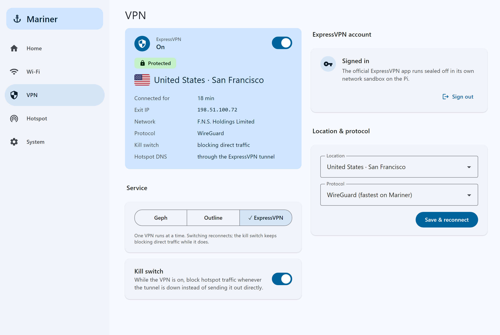
</p>
<p align="center">
  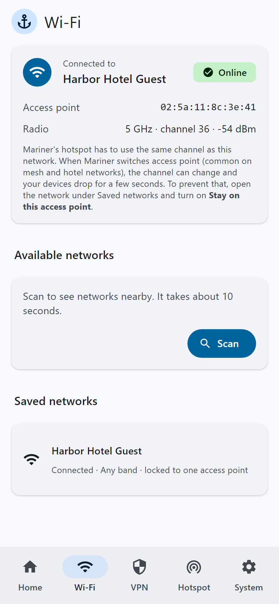
  &nbsp;
  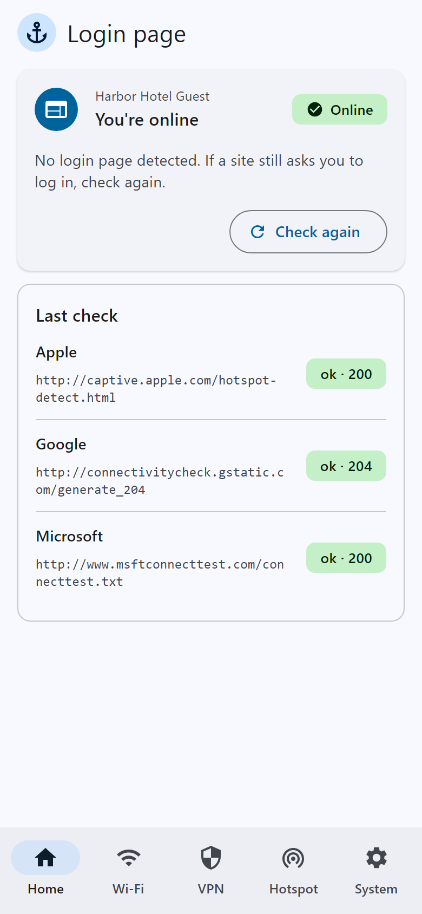
  &nbsp;
  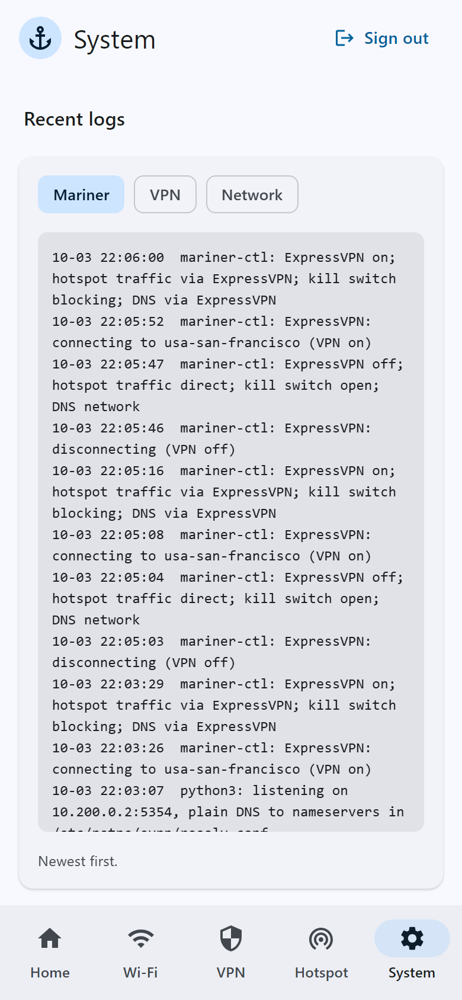
</p>
<p align="center">
  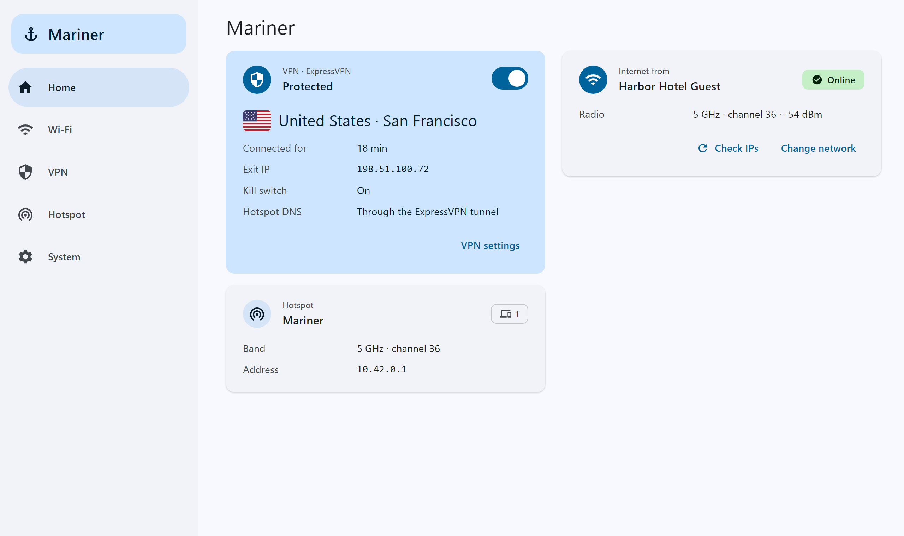
</p>
</details>

## Quick start

**You need:**
- a Raspberry Pi 4 or 400 with a 16 GB or larger SD card (other 64-bit Pis with a BCM43455 radio should work; the Pi 4 is what it's tested on)
- **64-bit Raspberry Pi OS (Bookworm or later)** or Debian 12/13, which use NetworkManager by default
- an ethernet cable for the first setup, so you aren't connected through the radio that's being reconfigured

**Install:**

```bash
curl -fsSL https://raw.githubusercontent.com/Jotspot/mariner/main/bootstrap.sh | sudo bash
```

The installer walks you through a few questions (hotspot name and password, Wi-Fi country, which VPNs, hostname), shows a review, and then installs everything with a progress line per step. Press Enter at any question to take the default.

<p align="center">
  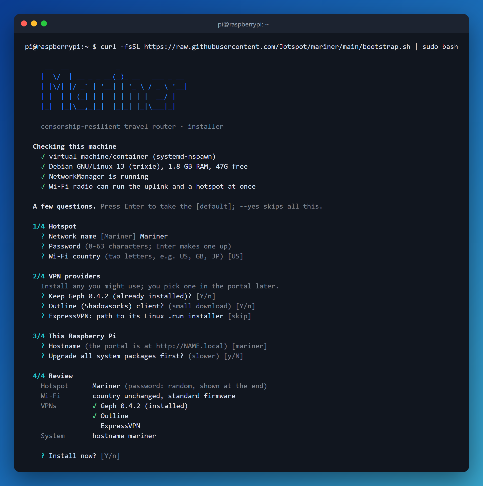
  &nbsp;
  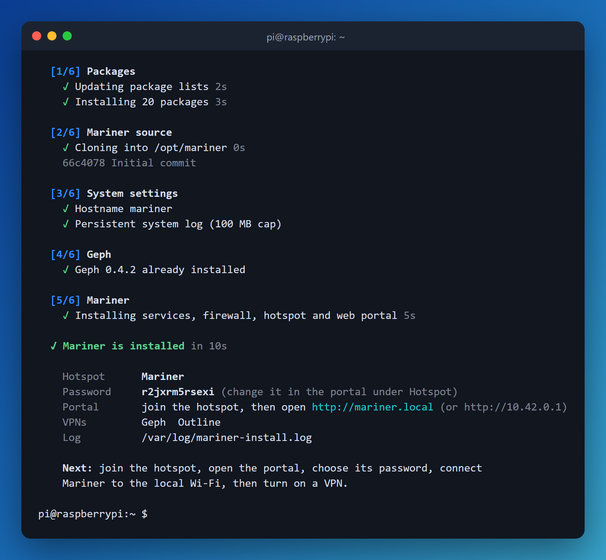
</p>

Compiling Geph takes 30–60 minutes on a Pi 4 (there's no prebuilt ARM64 release); everything else takes a few minutes. When it's done:

1. Join the hotspot from your phone with the password the installer printed.
2. Open **http://mariner.local** (or `http://10.42.0.1`) and choose a control-panel password.
3. **Wi-Fi** → join the hotel network. **VPN** → add your account and switch it on.

**Unattended install:** pass options to answer questions in advance, and `--yes` to skip the rest:

```bash
curl -fsSL https://raw.githubusercontent.com/Jotspot/mariner/main/bootstrap.sh | sudo bash -s -- --yes --country US --no-geph
```

### Installer options

| Option | What it does |
|---|---|
| `--ssid NAME` / `--hotspot-password PW` | Hotspot name and password (default: `Mariner` and a random password) |
| `--country CC` | Wi-Fi regulatory country, e.g. `US`, `GB`, `JP` |
| `--hostname NAME` | Hostname and `NAME.local` (default `mariner`) |
| `--no-geph` | Skip Geph (saves the 30–60 min compile) |
| `--geph-binary PATH` | Install an existing `geph5-client` build instead of compiling |
| `--geph-version V` | Geph version to compile (default: the tested one) |
| `--no-outline` | Skip the Outline (Shadowsocks) client |
| `--expressvpn-installer FILE` | Also install ExpressVPN from its official `.run` installer (path or `https://` link), sandboxed. See [ExpressVPN](#expressvpn) |
| `--add-expressvpn FILE` | Add ExpressVPN to an already installed Mariner, changing nothing else |
| `--no-hotspot` | Don't create the hotspot |
| `--standard-firmware` | Keep the default Wi-Fi firmware (Mariner switches to the more stable "minimal" build) |
| `--keep-cloud-init` | Don't disable cloud-init |
| `--upgrade` | Run a full system upgrade first |
| `--dry-run` | Show what would happen, change nothing |
| `-y`, `--yes` | Unattended: no questions, no pauses (defaults fill in anything not given) |
| `--no-wizard` | No questions, but still pause on warnings |

The installer is idempotent: run it again to update Mariner or change options. Package output goes to `/var/log/mariner-install.log` (readable by root only).

## ExpressVPN

ExpressVPN has no open protocol Mariner could speak itself, so Mariner runs **ExpressVPN's official Linux app** and seals it inside its own network namespace (see [Where the traffic goes](#where-the-traffic-goes-per-vpn)). You bring the app's installer, because downloading it needs your account.

**1. Get the installer.** Sign in at [expressvpn.com](https://www.expressvpn.com/), open the **setup** page for your subscription, choose **Linux** and download the app. The file is called something like `expressvpn-linux-universal-14.3.1.15429_release.run`; "universal" means it carries builds for every CPU and picks the right one (Mariner has run it on a Pi 4). The setup page also shows your **activation code**; keep it for step 4. The installer checks that the file really is ExpressVPN's installer before running it.

**2. Copy it to the Pi** from the computer you downloaded it on (use your Pi's user and hostname):

```bash
scp expressvpn-linux-universal-*.run pi@mariner.local:
```

**3a. During setup:** when the installer reaches the ExpressVPN question, enter the file's path (or an `https://` link to it). Unattended: `--expressvpn-installer ~/expressvpn-linux-universal-*.run`.

**3b. Later, on an installed Mariner:** run only the ExpressVPN step. Your hotspot, passwords, VPN settings and other providers stay as they are:

```bash
curl -fsSL https://raw.githubusercontent.com/Jotspot/mariner/main/bootstrap.sh | sudo bash -s -- --add-expressvpn expressvpn-linux-universal-*.run
```

Run it again any time to update the app with a newer installer.

**4. Sign in.** In the control panel, open **VPN**, choose **ExpressVPN** and paste the activation code. Mariner never stores it: it goes straight to the app.

Good to know:
- The app only ever runs inside the `evpn` sandbox, and only while ExpressVPN is the chosen VPN. Its own kill switch ("Network Lock") stays off; Mariner's kill switch covers the hotspot instead, and a guard inside the sandbox drops anything that doesn't leave through ExpressVPN's tunnel.
- Mariner uses **WireGuard** by default. ExpressVPN's Lightway works too, but runs at only about 1–2 Mbit/s on a Pi 4.
- The control panel can't install ExpressVPN, on purpose: a panel that could upload and run an installer as root would turn any panel compromise into full control of the Pi.

## How it works

### The big picture

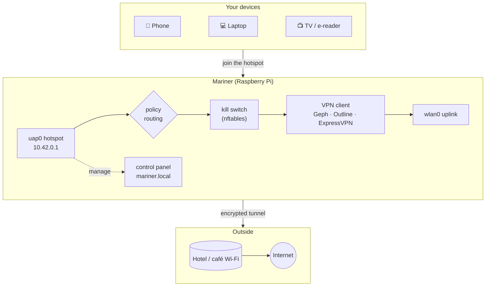

The Pi's single Wi-Fi chip runs two interfaces at once: `wlan0` joins the hotel network and `uap0` is your private hotspot. Only traffic from the hotspot is routed into the VPN. The Pi's own traffic (the VPN's connection to its servers, captive-portal checks) goes out directly, which is what makes this work behind portals and blocks.

### Where the traffic goes, per VPN

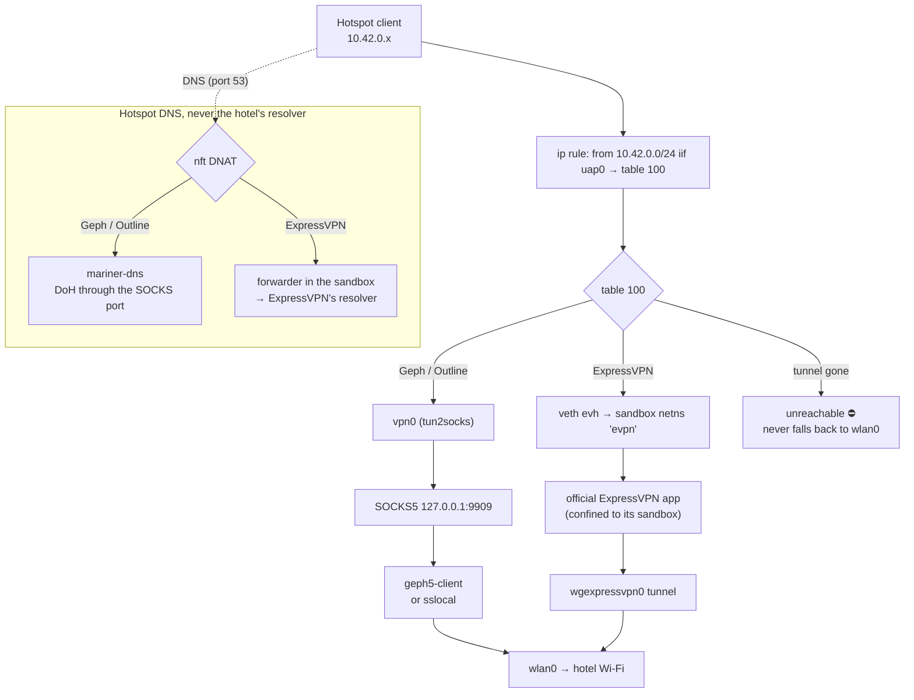

ExpressVPN's app expects to control the whole machine's routing and firewall. Mariner runs it inside its own **network namespace**, so it only controls a sandbox, and a guard inside that sandbox drops anything that doesn't leave through ExpressVPN's tunnel.

### The VPN state machine

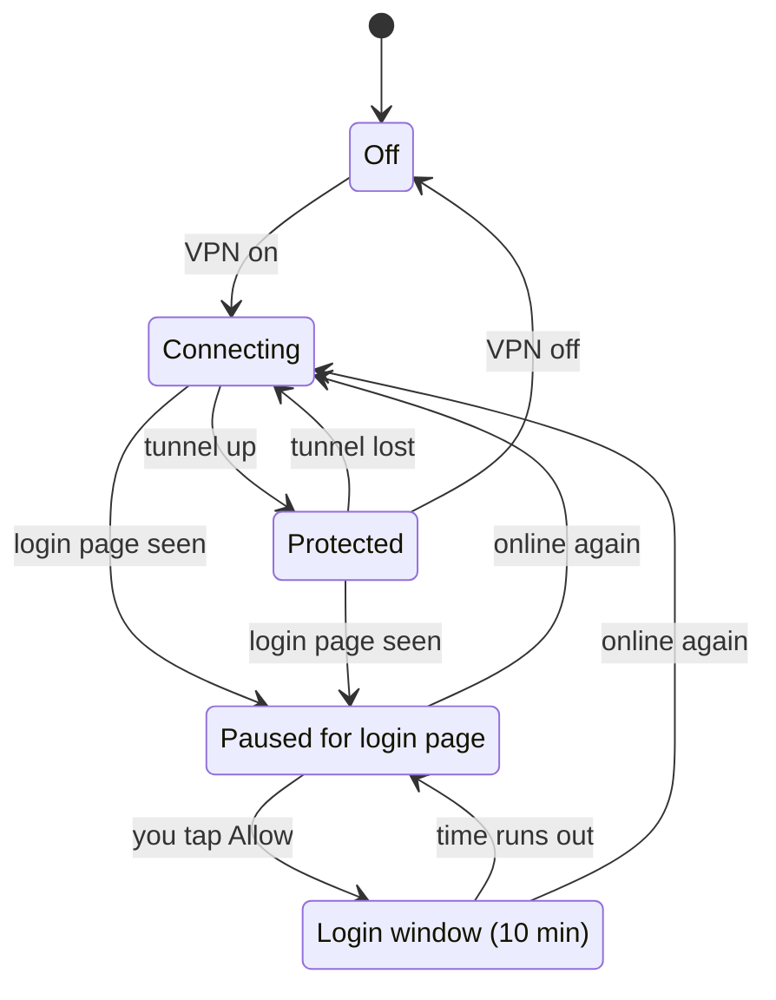

- **Tunnel lost:** while it reconnects, the kill switch blocks hotspot traffic instead of letting it out unprotected.
- **Paused for login page:** the VPN stops, but the kill switch keeps blocking, so devices can't leak while the hotel page is up.
- **Login window:** for 10 minutes, direct traffic is allowed so you can sign in to the hotel page. Mariner reconnects the VPN as soon as the network is online.

`mariner-ctl reconcile` is the single place this logic lives. It runs at boot (before networking), every minute, after every network change and after every setting change, and it always applies the blocking rules **first**.

### Captive-portal detection

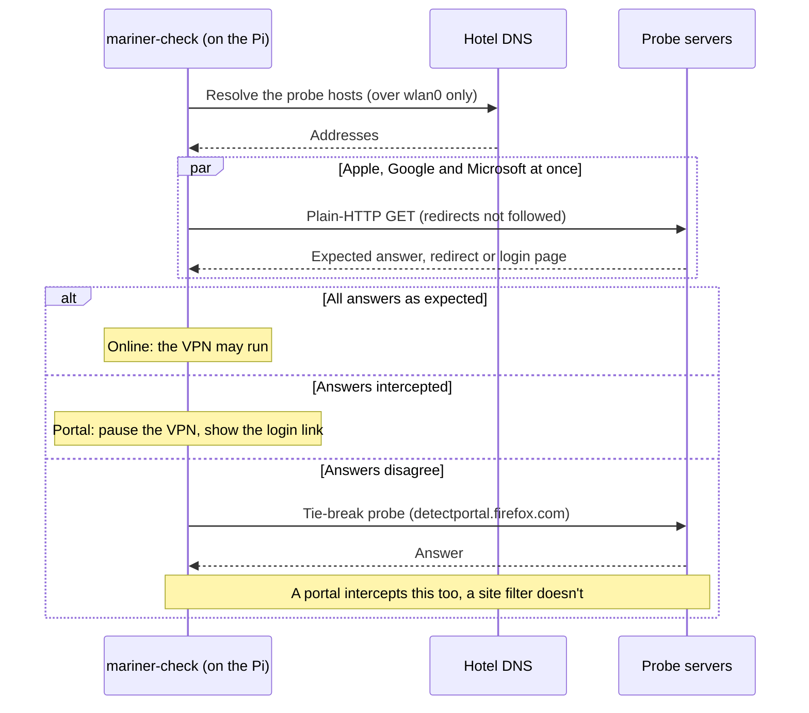

The detector is tested offline against **108 simulated networks**: redirects, inline login pages, 511s, DNS hijacking, walled gardens, censoring filters, transparent proxies, malformed DNS and HTTP, slowloris servers and more. Run it with `python tests/portal-sim/portal_sim.py`.

## Using it on the road

- **Captive portal:** the home screen shows *This network needs you to log in*. Tap **Open login page** (or **Allow this device 10 min** first if the kill switch is on: only that device gets direct access), log in, and Mariner resumes the VPN within a minute. If the captured login link has expired, **Open a plain-HTTP page** makes the network show its login page again.
- **Hotspot won't start on a hotel network:** the network is probably on a 5 GHz radar (DFS) channel, where the Pi may not run a hotspot. In **Wi-Fi**, open the network and choose **2.4 GHz**.
- **Devices keep dropping on a mesh or hotel network:** the uplink is roaming between access points and dragging the hotspot's channel with it. Turn on **Stay on this access point**.
- **"Allow this device 10 min" on any network:** if the VPN won't connect although the network looks fine (some hotels hide their login page from detection), the home screen offers it after a few minutes. Only the device that asks gets direct access; everything else stays behind the kill switch.
- **IPv6-only networks:** the captive-portal check uses IPv4, so an uplink with no IPv4 at all (IPv6-only with NAT64) shows as *offline*, even if it works. The hotspot itself is IPv4-only too.
- **Change the Wi-Fi country** for the country you're in (`--country` on install, or re-run the installer). It sets the radio's legal channels and power.

## Security model

- **Fail closed.** The kill switch is applied before any service starts, at boot and on every reconcile. Even with the VPN process dead, hotspot traffic has no route out but the tunnel.
- **Least privilege.** The control panel runs as an unprivileged user. Its only privilege is one sudo rule for `mariner-ctl`, which validates every input and takes secrets on stdin, never on the command line.
- **Secrets stay on the device.** VPN credentials are stored in root-only files. ExpressVPN activation codes are handed to the official app and shredded. Nothing is sent anywhere but the VPN provider.
- **Hardened control panel.** It's reachable only from the hotspot. Password is scrypt-hashed, sessions are signed SameSite cookies, every form carries a CSRF token, and there's a strict Content-Security-Policy and login rate limiting.
- **Not exposed upstream.** The control panel, the hotspot's DNS and DHCP, the DNS proxy and SSH aren't reachable from the hotel network.
- **ExpressVPN is sandboxed** in its own network namespace, so it can't change the Pi's routing, DNS or firewall.

**Limitations to know about:**
- A VPN hides your traffic from the local network. It doesn't make you anonymous to the VPN provider or to sites you sign in to.
- Using circumvention tools can be illegal in some countries. Know the rules where you travel.
- One radio means the hotspot follows the hotel network's channel. Switching access points briefly drops your devices.
- Throughput is limited by the Pi's single Wi-Fi radio. In testing, ExpressVPN over WireGuard or OpenVPN reached 70–90 Mbit/s, about the same as without a VPN. Geph's speed depends on its servers and your plan.
- Geph has no prebuilt ARM64 release, so it's compiled on the Pi (30–60 min, once).

## Project layout

| Path | What lives there |
|---|---|
| `bootstrap.sh` | One-line installer (checks, step-by-step questions, packages, Geph build) |
| `install.sh` | Idempotent deploy of Mariner itself; also used for updates |
| `bin/mariner-ctl` | The privileged control tool and VPN state machine |
| `bin/mariner-check` | Captive-portal and connectivity detector |
| `bin/mariner-dns` | Hotspot DNS proxy (DoH over SOCKS, or plain DNS in the ExpressVPN sandbox) |
| `bin/mariner-evpn-netns` | ExpressVPN sandbox and its leak guard |
| `web/` | Control panel (FastAPI, Jinja, hand-written Material 3 CSS) |
| `systemd/`, `nm/` | Units, timers, NetworkManager and udev configuration |
| `tests/` | Leak-test client, fake captive portal, Outline self-test, 108-scenario portal simulator |
| `docs/ARCHITECTURE.md` | In-depth design notes and measurements |

## Credits

Mariner builds on excellent open-source work:
- [Geph](https://github.com/geph-official/geph5)
- [tun2socks](https://github.com/xjasonlyu/tun2socks)
- [shadowsocks-rust](https://github.com/shadowsocks/shadowsocks-rust)
- [FastAPI](https://fastapi.tiangolo.com/)
- [Material Icons](https://fonts.google.com/icons) (Apache 2.0)
- [Twemoji](https://github.com/twitter/twemoji) country flags via [country-flag-emoji-polyfill](https://github.com/talkjs/country-flag-emoji-polyfill) (CC-BY 4.0 / MIT)

ExpressVPN, Outline and Geph are trademarks of their respective owners.

## License

[MIT](LICENSE). Third-party components keep their own licences (see Credits).
